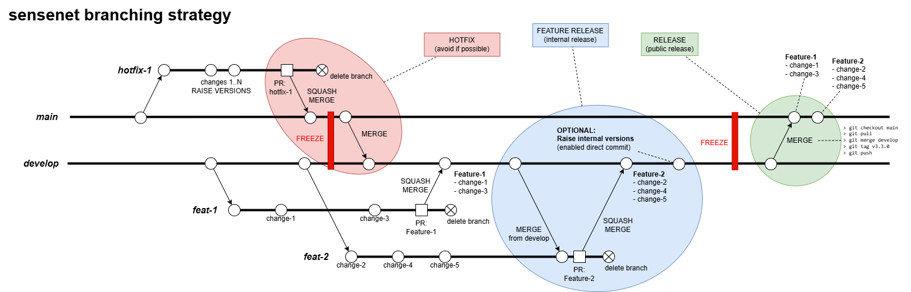

# -- under construction --

# SENSENET BRANCHING STRATEGY
A proposal for a commonly used "sensenet branching strategy" that describes the 
efficient management of sensenet source code for development teams.

